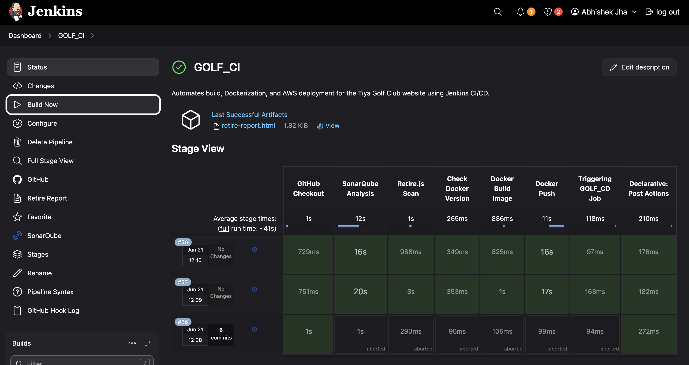

# Golf-Club-AWS-Deployment-Pipeline
## Overview
This project showcases a fully **automated CI/CD pipeline** for a static Golf Club website, built using **Jenkins, Docker**, and hosted on **AWS EC2**.

The frontend was developed using basic HTML, CSS, and JavaScript. I took charge of the entire DevOps lifecycle: from automating quality and security checks to building and deploying Docker containers. The pipeline was built from scratch, integrating tools like **SonarQube, Retire.js, Docker Hub, and GitHub webhooks**.

## 🔁 CI/CD Workflow Overview
Whenever code is pushed to the main branch of this repository, a GitHub webhook automatically triggers a Jenkins pipeline. Here's what happens next:

- Jenkins clones the repository.
- SonarQube runs static code analysis to ensure code quality.
- Retire.js scans JavaScript dependencies for known vulnerabilities.
- A Docker image is built using Nginx to serve the static files.
- The image is pushed to Docker Hub.
- Jenkins triggers a separate job called GOLF_CD which pulls the latest image and runs it on a live AWS EC2 instance.

This results in seamless deployment with zero manual intervention.

## 🧑‍💻 What I Built (DevOps Focus)
I didn’t build the frontend, but I:
- Created the complete Jenkins pipeline with multiple automated stages
- Integrated SonarQube and Retire.js for quality and security checks
- Wrote a Dockerfile using Nginx to containerize the static website
- Connected Jenkins to Docker Hub for pushing production images
- Deployed the app to an Ubuntu-based EC2 instance on AWS, exposing port 80
- Connected GitHub via webhook to ensure automatic pipeline triggers on every push
- Set up and triggered a secondary Jenkins deployment job GOLF_CD

## ⚙️ Technologies Used
- HTML, CSS, JavaScript – Static frontend
- Jenkins (Declarative Pipeline) – Full CI/CD automation
- SonarQube – Code quality analysis
- Retire.js – JavaScript vulnerability scanning
- Docker & Docker Hub – Containerization & image registry
- Nginx – Web server to serve static files
- AWS EC2 (Ubuntu) – Production server (port 80 exposed)
- GitHub Webhooks – Auto-trigger CI/CD on push

## 🧠 Why This Project Matters
This project is a great example of how even a simple static website can be treated as a production-grade application using DevOps practices. It demonstrates the real-world application of tools like Jenkins, Docker, and AWS in building secure, automated, and scalable pipelines.

Whether you're working with a monolith or a microservice, frontend or backend — automation is key, and this project proves it.

## Screenshots
  
  
  
 

## 🙋‍♂️ About Me
Hi, I’m Abhishek Jha, a DevOps Engineer passionate about **automation**, **infrastructure**, and **cloud-native deployments**. I built this project to demonstrate my CI/CD skills, cloud experience, and ability to bring DevOps best practices even to static sites.

GitHub: [abhijha16](https://github.com/abhijha16)
Docker Hub: [abhishek365](https://hub.docker.com/u/abhishek365)
